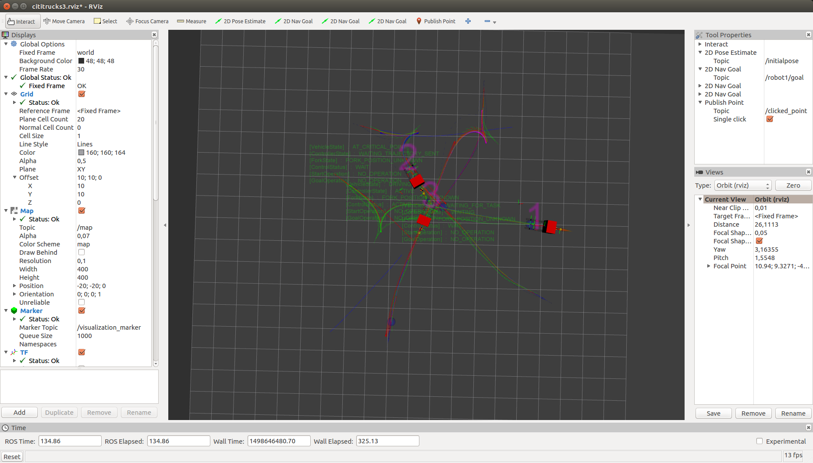

# coordination_oru_ros
This package provides an online coordination method for multiple robots for the <a href="https://github.com/OrebroUniversity/navigation_oru-release">navigation_oru</a> package. It is based on the <a href="https://github.com/FedericoPecora/coordination_oru">coordination_oru</a> implementation of a trajectory-envelope based coordination algorithm.

## Pre-requisites
Please follow the installation instructions for the <a href="https://github.com/FedericoPecora/coordination_oru">coordination_oru</a> package first. This will make the ```coordination_oru``` library available to this package via your local local Maven repository.

## Installation
After installing the ```coordination_oru``` package as instructed above, clone this repository into your ```catkin_ws/src``` directory and compile the source code with ```catkin_make```, which in turn runs a gradle build (redistributable included):

```
$ cd catkin_ws/src
$ git clone https://github.com/FedericoPecora/coordination_oru_ros.git
$ cd ..
$ catkin_make
```

## Examples
Two launch files are provided, one involving a single robot, and one involving three robots. The single robot example is launched as follows:

```
$ roslaunch coordination_oru_ros single_truck.launch
```

This will bring up an ```rviz``` window from which goals can be posted for the single robot (via the "2D Nav Goal" button on top). Each time a goal is posted, the path is computed via a call to the ```ComputeTask``` service, and dispatched to the ```vehicle_execution_node``` via a call to the ```ExecuteTask``` service. The example does not involve coordaintion (as there is only one robot), and is meant to show how these services are called by the ```MainNode.java``` ROS node. The external behavior of the system is identical to that of the ```single_truck.launch``` launch file provided as an example in the <a href="https://github.com/OrebroUniversity/navigation_oru-release">navigation_oru</a> package.

The following launch file starts an example with three robots:

```
$ roslaunch coordination_oru_ros multiple_trucks.launch
```

The launch file opens an ```rviz``` window from which one can post goals for any of the three robots (via the three "2D Nav Goal" buttons on top). Goals can be posted online, and the robots will be coordinated according to the coordination algorithm implemented in the <a href="https://github.com/FedericoPecora/coordination_oru">coordination_oru</a> package (see <a href="https://github.com/FedericoPecora/coordination_oru#overview">here</a> for a brief explanation of the algorihtm).

The images below show three moments during the coordinated navigation of the three robots.





